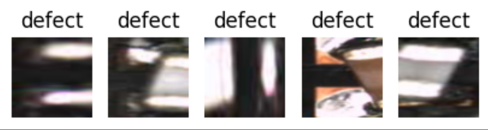
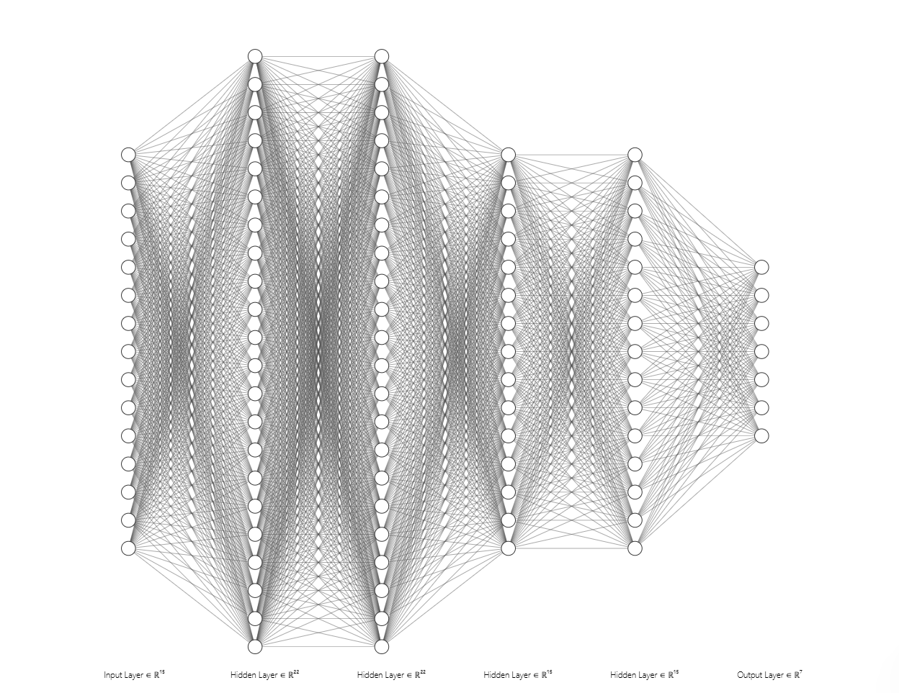
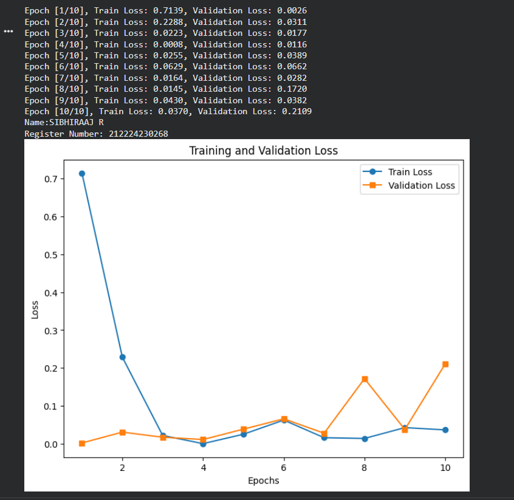
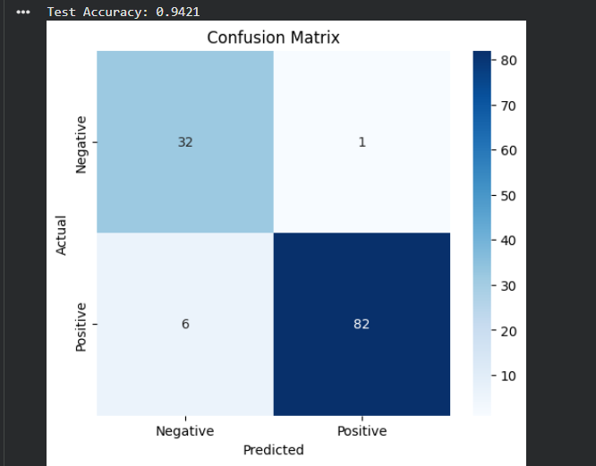
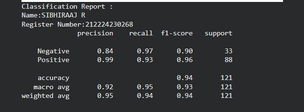
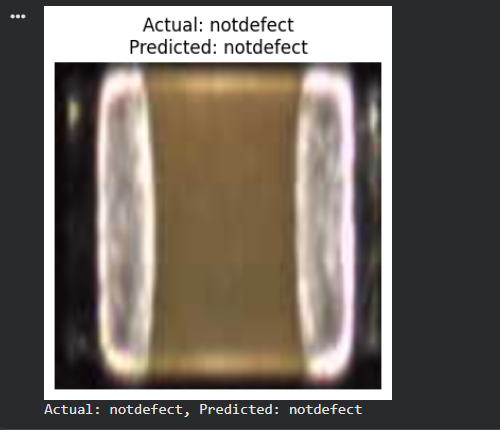
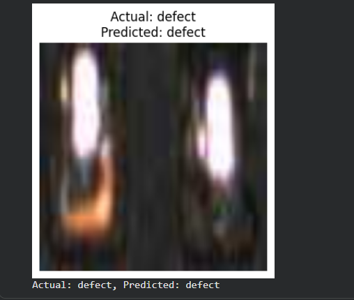

# DL- Developing a Neural Network Classification Model using Transfer Learning

## AIM
To develop an image classification model using transfer learning with VGG19 architecture for the given dataset.

## Problem Statement and Dataset
Transfer Learning is a technique where a pre-trained model (trained on a large dataset such as ImageNet) is used as a starting point for a different but related task. It leverages learned features from the original task to improve learning efficiency and performance on the new task.

VGG19 is a convolutional neural network with 19 layers. It consists of multiple convolutional layers for feature extraction, followed by fully connected layers for classification. In transfer learning, we typically freeze the convolutional layers and retrain the final fully connected layers to match our dataset.



## Neural Network Model


## DESIGN STEPS
### STEP 1: 

Write your own stepsLoad and preprocess the dataset using ImageFolder and apply required image transformations.

### STEP 2: 

Create DataLoaders for training and testing with appropriate batch size.

### STEP 3: 

Load the pretrained VGG19 model and modify the final fully connected layer for binary classification.

### STEP 4: 

Freeze feature extraction layers and define the loss function (BCEWithLogitsLoss) and optimizer (Adam).

### STEP 5: 

Train the model for multiple epochs while computing training and validation loss.

### STEP 6: 

Evaluate the model using sigmoid-based predictions and generate the confusion matrix and classification report.


## PROGRAM

### Name: SIBHIRAAJ R

### Register Number: 212224230268

```
import torch
import torch.nn as nn
import torch.optim as optim
import torchvision
import torchvision.transforms as transforms
from torch.utils.data import DataLoader
from torchvision import models, datasets
import matplotlib.pyplot as plt
import numpy as np
from torchvision.models import VGG19_Weights
from sklearn.metrics import confusion_matrix, classification_report
import seaborn as sns

## Step 1: Load and Preprocess Data
# Define transformations for images
transform = transforms.Compose([
    transforms.Resize((224, 224)),  # Resize images for pre-trained model input
    transforms.ToTensor(),
    #transforms.Normalize([0.485, 0.456, 0.406], [0.229, 0.224, 0.225])  # Standard normalization for pre-trained models
])

!unzip -qq ./chip_data.zip -d data

# Load dataset from a folder (structured as: dataset/class_name/images)
dataset_path = "./data/dataset/"
train_dataset = datasets.ImageFolder(root=f"{dataset_path}/train", transform=transform)
test_dataset = datasets.ImageFolder(root=f"{dataset_path}/test", transform=transform)

# Display some input images
def show_sample_images(dataset, num_images=5):
    fig, axes = plt.subplots(1, num_images, figsize=(5, 5))
    for i in range(num_images):
        image, label = dataset[i]
        image = image.permute(1, 2, 0)  # Convert tensor format (C, H, W) to (H, W, C)
        axes[i].imshow(image)
        axes[i].set_title(dataset.classes[label])
        axes[i].axis("off")
    plt.show()

# Show sample images from the training dataset
show_sample_images(train_dataset)

# Get the total number of samples in the training dataset
print(f"Total number of training samples: {len(train_dataset)}")

# Get the shape of the first image in the dataset
first_image, label = train_dataset[0]
print(f"Shape of the first image: {first_image.shape}")

# Get the total number of samples in the testing dataset
print(f"Total number of training samples: {len(test_dataset)}")

# Get the shape of the first image in the dataset
first_image1, label = test_dataset[0]
print(f"Shape of the first image: {first_image1.shape}")

# Create DataLoader for batch processing
train_loader = DataLoader(train_dataset, batch_size=32, shuffle=True)
test_loader = DataLoader(test_dataset, batch_size=32, shuffle=False)

## Step 2: Load Pretrained Model and Modify for Transfer Learning
# Load a pre-trained VGG19 model
# write your code here
model=models.vgg19(weights=VGG19_Weights.DEFAULT)

# Move model to GPU if available
device = torch.device("cuda" if torch.cuda.is_available() else "cpu")
model = model.to(device)

from torchsummary import summary
# Print model summary
summary(model, input_size=(3, 224, 224))

# Modify the final fully connected layer to match the dataset classes
# Write your code here
model.classifier[-1]=nn.Linear(model.classifier[-1].in_features,1)

# Move model to GPU if available
device = torch.device("cuda" if torch.cuda.is_available() else "cpu")
model = model.to(device)

summary(model, input_size=(3, 224, 224))

# Freeze all layers except the final layer
for param in model.features.parameters():
    param.requires_grad = False  # Freeze feature extractor layers

# Include the Loss function and optimizer
criterion =nn.BCEWithLogitsLoss()
optimizer =optim.Adam(model.parameters(),lr=0.001)

## Step 3: Train the Model
def train_model(model, train_loader,test_loader,num_epochs=10):
    # Write your code here
    train_losses=[]
    val_losses=[]
    model.train()
    for epoch in range(num_epochs):
      running_loss=0.0
      for images,labels in train_loader:
        images,labels=images.to(device),labels.to(device)
        optimizer.zero_grad()
        outputs=model(images)
        loss=criterion(outputs,labels.unsqueeze(1).float())
        loss.backward()
        optimizer.step()
        running_loss+=loss.item()
      train_losses.append(running_loss/len(train_loader))
      model.eval()
      val_loss=0.0
      with torch.no_grad():
        for images,labels in test_loader:
          images,labels=images.to(device),labels.to(device)
          outputs=model(images)
          loss=criterion(outputs,labels.unsqueeze(1).float())
          val_loss=loss.item()
      val_losses.append(val_loss/len(test_loader))
      model.train()

        # Compute validation loss
        # Write your code here

      print(f'Epoch [{epoch+1}/{num_epochs}], Train Loss: {train_losses[-1]:.4f}, Validation Loss: {val_losses[-1]:.4f}')

    # Plot training and validation loss
    print("Name:SIBHIRAAJ R")
    print("Register Number: 212224230268")
    plt.figure(figsize=(8, 6))
    plt.plot(range(1, num_epochs + 1), train_losses, label='Train Loss', marker='o')
    plt.plot(range(1, num_epochs + 1), val_losses, label='Validation Loss', marker='s')
    plt.xlabel('Epochs')
    plt.ylabel('Loss')
    plt.title('Training and Validation Loss')
    plt.legend()
    plt.show()

# Move model to GPU if available
device = torch.device("cuda" if torch.cuda.is_available() else "cpu")
model = model.to(device)

# Train the model
# Write your code here
train_model(model,train_loader,test_loader)

def test_model(model,test_loader):
  model.eval()
  correct=0
  total=0
  all_preds=[]
  all_labels=[]

  with torch.no_grad():
    for images,labels in test_loader:
      images=images.to(device)
      labels=labels.float().unsqueeze(1).to(device)

      outputs=model(images)
      probs=torch.sigmoid(outputs)
      predicted=(probs > 0.5).int()
      total+=labels.size(0)
      correct+=(predicted==labels.int()).sum().item()

      all_preds.extend(predicted.cpu().numpy())
      all_labels.extend(labels.cpu().numpy().astype(int))
  accuracy=correct/total
  print(f"Test Accuracy: {accuracy:.4f}")

  class_names=['Negative','Positive']
  cm=confusion_matrix(all_labels,all_preds)
  plt.figure(figsize=(6,5))
  sns.heatmap(cm,annot=True,fmt='d',cmap='Blues',xticklabels=class_names,yticklabels=class_names)
  plt.xlabel("Predicted")
  plt.ylabel("Actual")
  plt.title("Confusion Matrix")
  plt.show()

  
  print("Classification Report :")
  print("Name:SIBHIRAAJ R")
  print("Register Number:212224230268")
  print(classification_report(all_labels,all_preds,target_names=class_names))

# Evaluate the model
# write your code here
test_model(model,test_loader)

## Step 5: Predict on a Single Image and Display It
def predict_image(model, image_index, dataset):
    model.eval()
    image, label = dataset[image_index]
    with torch.no_grad():
        image_tensor = image.unsqueeze(0).to(device)
        output = model(image_tensor)

        # Apply sigmoid to get probability, threshold at 0.5
        prob = torch.sigmoid(output)
        predicted = (prob > 0.5).int().item()


    class_names = class_names = dataset.classes
    # Display the image
    image_to_display = transforms.ToPILImage()(image)
    plt.figure(figsize=(4, 4))
    plt.imshow(image_to_display)
    plt.title(f'Actual: {class_names[label]}\nPredicted: {class_names[predicted]}')
    plt.axis("off")
    plt.show()

    print(f'Actual: {class_names[label]}, Predicted: {class_names[predicted]}')

# Example Prediction
predict_image(model, image_index=55, dataset=test_dataset)

#Example Prediction
predict_image(model, image_index=25, dataset=test_dataset)

```

### OUTPUT

## Training Loss, Validation Loss Vs Iteration Plot



## Confusion Matrix



## Classification Report


### New Sample Data Prediction
 

## RESULT
Thus, an image classification model was developed using transfer learning with the VGG19 architecture for the given dataset, achieving limited classification performance.
